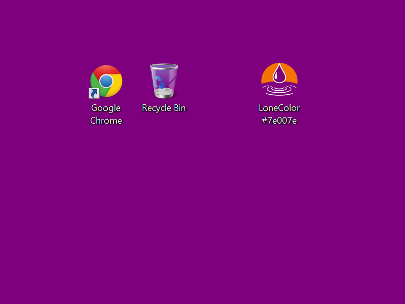

# LoneColor for Windows

> "LoneColor boasts what could appropriately be called a zero interface. ... a very simple and unique app." 
> &mdash; <cite>AddictiveTips</cite>

Use the free, tiny and portable LoneColor application to set any solid color you like as your Desktop wallpaper, or let it surprise you with a beautiful random color wallpaper.

LoneColor is very easy to use: simply drop the application or its shortcut on your Desktop and double-click it: you will get a random color wallpaper. Rename `LoneColor` to `LoneColor Pink`, run it and you will get a Pink wallpaper. Or copy any color code from any site, community, online tool or software program, and click LoneColor to see it instantly fill your screen.

Solid color wallpapers may be a welcome, refreshing and modern change from the traditional photo Wallpapers. They also free up valuable memory and make computers run faster.

## Zero Interface

LoneColor has a minimal design and it doesn't need or have a Graphical User Interface. To specify the color you want to use, you simply insert it into the name of the application: by color name (`LoneColor Red`), Web color code (`LoneColor #38D891`), RGB triplet (`LoneColor 82,165,33`), etc. It's like using command line parameters, but a lot easier. And less technical. 

With LoneColor it's also very easy to go back. Want to restore your old photo wallpaper? Rename `LoneColor` to `LoneColor C` (or create a `LoneColor C` shortcut), run it, and it will automatically open the Desktop Background Control Panel, where you can easily undo changes. 

LoneColor also has a zero interface [version for Android](https://github.com/appgramming/LoneColor-Android) smartphones and tablets.

## Download

The latest stable version of LoneColor can be downloaded from [Appgramming](https://www.appgramming.com/lonecolor/windows/download/). You can download the Installation package, or a fully portable edition that does not require installation. LoneColor runs on Windows 10, 8, 7, Vista, and XP.

## Contributions

Contributions are welcome: code, text, documentation, design, graphics, suggestions. Please fork this repository and contribute back using [pull requests](https://github.com/appgramming/LoneColor-Windows/pulls), [submit an issue](https://github.com/appgramming/LoneColor-Windows/issues), or [send an email](https://www.appgramming.com/support/).

## Author

LoneColor for Windows was created in 2012 by [Horațiu Tănescu](https://horatiu.me), cofounder of [East-Tec](https://www.east-tec.com) and original creator of [east-tec Eraser](https://www.east-tec.com/eraser/), the privacy solution that quickly and securely covers your online and PC tracks.

## License

LoneColor is licensed under the [MIT license](LICENSE).
